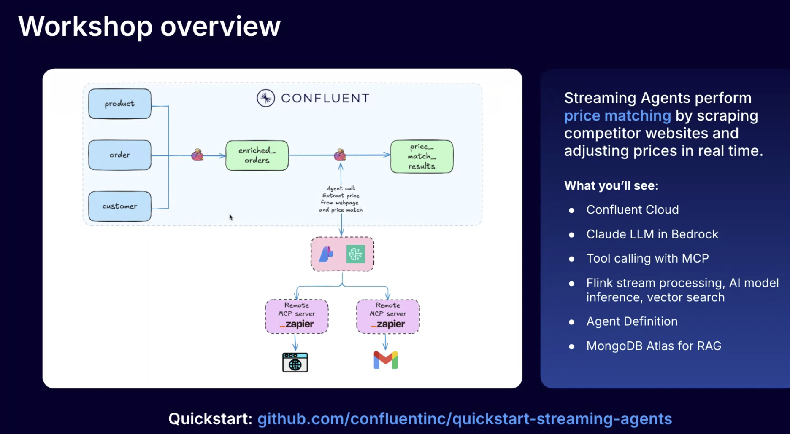
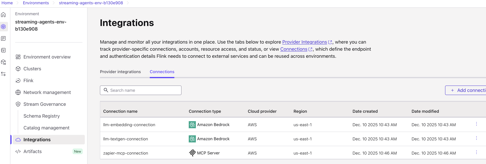

# Lab1: Price Matching Orders with MCP Tool Calling Agent Walkthrough

In this lab, we'll use Apache Flink for Confluent Cloud's MCP tool calling feature to "price match" customer orders in real-time. Flink, through tool calling, uses a remote MCP server to retrieve competitor prices, and if a competitor offers a better price, the agent automatically applies a price match and uses tool calling again to email the customer a summary.




## Prerequisites

- Zapier free account and remote MCP server set up (instructions [here](./assets/pre-setup/Zapier-Setup.md))

> [!WARNING]
>
> **AWS Users Only:** To access Claude Sonnet 3.7 you must request access to the model by filling out an Anthropic use case form (or someone in your org must have previously done so) for your cloud region. To do so, visit the [Model Catalog](https://console.aws.amazon.com/bedrock/home#/model-catalog), select Claude 3.7 Sonnet and open it it in the Playground, then send a message in the chat - the form will appear automatically.

## Deploy the Demo

Once you have these credentials ready, run the following command and choose **Lab1** (see [main README](./README.md)):

  ```bash
  uv run deploy --workshop
  ```



# Getting Started

## 1. Test the LLM models before continuing

Once you've deployed Lab1, run the following queries in the SQL Workspace to make sure your models are working as expected:

#### Test Query 1: Base LLM model

```sql
SELECT
  question,
  response
FROM (SELECT 'How was the state of Colorado founded?' as question) t,
LATERAL TABLE(ML_PREDICT('llm_textgen_model', question, MAP['debug', 'true'])) as r(response);
```

#### Test Query 2: LLM Tool Calling Model

> [!WARNING]
>
> Don't forget to add the email address where you want to receive the test email, to the query below.

```sql
 SELECT
      AI_TOOL_INVOKE(
          'zapier_mcp_model',
          'Use the gmail_send_email tool to send an email. 
           The "to" parameter must be a single string value: <<YOUR-EMAIL-ADDRESS-HERE>>
           The "subject" parameter is: Direct Query Test
           The "body" parameter is: This email was sent directly from Confluent Cloud!
           Important: pass the to address as a string, not an array.',
          MAP[],
          MAP['gmail_send_email', 'Create and send a new email message'],
          MAP['debug', 'true']
      ) as response;
```

## 2. Generate Data

Open **Docker Desktop**, then begin generating data with the following command:

```bash
uv run lab1_datagen
```

<details>
<summary>Alternative: Using Python directly</summary>

```bash no-parse
python scripts/lab1_datagen.py
```

The Python script provides the same automation as the uv version.

</details>

The data generator creates three typical ecommerce data streams:

- **`customers`**: 100 customer records with realistic names, emails, addresses, and state information
- **`products`**: 17 product records including electronics, games, sports equipment, and household items with prices ranging from $5-$365
- **`orders`**: Continuous stream of orders linking customers to products with timestamps

## Run SQL Queries

## 3. Create `orders_enriched` table for the agent to use

Enrich the incoming orders stream with customer and product details.
We’ll use regular joins for this step and configure a state TTL to prevent the state from growing indefinitely.

```sql
SET 'sql.state-ttl' = '1 HOURS';

CREATE TABLE enriched_orders AS
SELECT
    o.order_id,
    p.product_name,
    c.customer_email,
    o.price AS order_price
FROM orders o
JOIN customers c ON o.customer_id = c.customer_id
JOIN products p ON o.product_id = p.product_id;
```

> NOTE: Leave the query running so that it runs continously.

### 4. Run  `CREATE TOOL` and `CREATE AGENT`

The agent will use the [Tool Calling](https://docs.confluent.io/cloud/current/ai/builtin-functions/invoke-tool-ai-workflow.html) feature to scrape competitors’ websites, extract the price of the same product, and send an email when a price match is found.
Create a new tool that leverages your Zapier connection:

```sql
CREATE TOOL zapier
USING CONNECTION `zapier-mcp-connection`
WITH (
  'type' = 'mcp',
  'allowed_tools' = 'webhooks_by_zapier_get, gmail_send_email',
  'request_timeout' = '30'
);
```

Next, create a new agent and provide a **system prompt**.  
This agent will compare the extracted competitor price with our own product price and determine whether to trigger a price match and send an email notification.


```sql
CREATE AGENT price_match_agent
USING MODEL llm_textgen_model
USING PROMPT 'You are a price matching assistant that performs the following steps:

1. SCRAPE COMPETITOR PRICE: Use the webhooks_by_zapier_get tool to extract page contents from the competitor URL provided in the prompt. The URL will be in the format: https://www.walmart.com/search?q="PRODUCT_NAME"

2. EXTRACT PRICE: Analyze the scraped page content to find the product that most closely matches the product name. Extract only the price in format: XX.XX (for example: 29.95). If you cannot find a valid price, stop here.

3. COMPARE AND NOTIFY: Compare the extracted competitor price with our order price. If the competitor price is lower than our price, use the gmail_send_email tool to send a price match notification email. Use the exact format provided in the prompt for the email subject and body.

Return a summary of actions taken and results.'
USING TOOLS zapier
COMMENT 'Consolidated agent for scraping competitor prices and sending price match notifications'
WITH (
  'max_consecutive_failures' = '2',
  'MAX_ITERATIONS' = '10'
);
```

## 5. Run the Agent

The agent will take `orders_enriched` as input and process each order in real time as it is generated.  
To run the agent continuously, we’ll execute it as part of a **Flink job**.  
Provide a **user prompt** to guide how the agent processes each incoming enriched order, and create a new table named `price_match_results` to store the agent’s evaluation results.

> [!WARNING]
>
> Don't forget to modify the line beginning with `EMAIL RECIPIENT:` in the query below to include the email address where you want the price matching emails sent! If you don't, you will not receive the price matching emails.


```sql
CREATE TABLE price_match_results AS
SELECT
    pmi.order_id,
    pmi.product_name,
    pmi.customer_email,
    CAST(CAST(pmi.order_price AS DECIMAL(10, 2)) AS STRING) as order_price,
    agent_result.status as agent_status,
    agent_result.response as agent_response
FROM enriched_orders pmi,
LATERAL TABLE(
    AI_RUN_AGENT(
        'price_match_agent',
         CONCAT(
          'COMPETITOR URL: https://www.walmart.com/search?q="', pmi.product_name, '"',
          '
          PRODUCT NAME: ', pmi.product_name, '
          
          OUR ORDER PRICE: $', CAST(CAST(pmi.order_price AS DECIMAL(10, 2)) AS STRING), '
          
          EMAIL RECIPIENT: <<YOUR-EMAIL-ADDRESS-HERE>>
          
          EMAIL SUBJECT: ✅ Great News! Price Match Applied - Order #', pmi.order_id, '
          
          EMAIL BODY TEMPLATE:
          Subject: Your Price Match Has Been Applied - Order #', pmi.order_id, '
          
          Dear Valued Customer,
          
          We have great news! We found a better price for your recent purchase and have automatically applied a price match.
          
          📦 ORDER DETAILS:
             • Order Number: #', pmi.order_id, '
             • Product: ', pmi.product_name, '
          
          💰 PRICE MATCH DETAILS:
             • Original Price: $', CAST(CAST(pmi.order_price AS DECIMAL(10, 2)) AS STRING), '
             • Competitor Price Found: $[INSERT_COMPETITOR_PRICE]
             • Your Savings: $[INSERT_SAVINGS]
          
          ✅ ACTION TAKEN:
          We have processed a price match refund of $[INSERT_SAVINGS] back to your original payment method. You should see this credit within 3-5 business days.
          
          🛒 WHY WE DO THIS:
          We are committed to offering you the best prices. Our automated price matching system continuously monitors competitor prices to ensure you always get the best deal.
          
          Thank you for choosing River Retail. We appreciate your business!
          
          Best regards,
          River Retail Customer Success Team
          📧 support@riverretail.com | 📞 1-800-RIVER-HELP
          
          ---
          This is an automated message from our price matching system.'
        ),
        pmi.order_id,
        MAP['debug', 'true']
    )
) as agent_result(status, response);
```

Our real-time price matching pipeline is complete—orders stream in, competitor prices are fetched and analyzed, and customers are instantly notified when they get the best deal.

Check out your email for price matched orders:

<details open>
<summary>Click to collapse</summary>


</details>

## Troubleshooting
<details>
<summary>Click to expand</summary>

- **Not getting emails?**
  - Ensure you replaced `<<YOUR-EMAIL-ADDRESS-HERE>>` in both the test query and the `CREATE TABLE price_match_input` query with the email address where you want to receive the emails. Be sure to use single quotes around your email address ('your@email.com').
  - **Run the MCP test query** to confirm your Zapier remote MCP server connection is working and able to send emails.
  - **Check the Zapier Zap history** at [mcp.zapier.com](https://mcp.zapier.com/) to see whether calls to send emails are going through at all, and if so, why they are failing.
  - **Make sure to run `uv run lab1_datagen`** to begin producing orders data.
- **Getting duplicate orders / duplicate price matching emails?**
  - Drop `orders`, `customers`, and `products` tables to start with a clean slate before re-running `uv run lab1_datagen`. The data generator randomly generates new customer information beginning with the same customer ID each time it is run, causing collisions if you do not clear the tables before restarting.

- `Runtime received bad response code 403. Please also double check if your model has multiple versions.` error?
  - **AWS?** Ensure you've activated Claude 3.7 Sonnet in your AWS account. See: [Prerequisites](#prerequisites)
  - **Azure?** Increase the tokens per minute quota for your GPT-4 model. Quota is low by default.

- `MCP error -32602: Invalid arguments for tool gmail_send_email` error?
  - Be sure to use single quotes around your email address ('your@email.com').
  - Configure the Gmail send email tool to specify the email address you want to send to directly.
  - Modify the model prompt to be more prescriptive about what format you need the email in (string, not array).
  </details>

## Navigation

- **← Back to Overview**: [Main README](./README.md)
- **→ Next Lab**: [Lab2: Vector Search / RAG](./LAB2-Walkthrough.md)
- **Cleanup**: [Cleanup Instructions](./README.md#cleanup)
