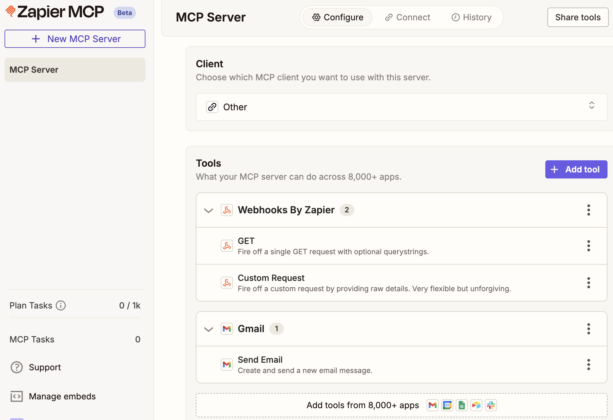

## Zapier Remote MCP Server Setup

Zapier (alternatives: Llangflow, n8n) is a web‑based automation and AI orchestration platform that lets you connect thousands of apps so they can pass data between each other and run tasks automatically, usually without writing code. It is designed to help individuals and teams automate repetitive work, such as moving data between tools, sending notifications, or updating records—by creating workflows that run in the background.

We will use it for the following purposes:
- Connecting to the Streaming Agent via a remote MCP server
- Calling tools like "Gmail: Send Email" to automate email notifications (e.g., for price matches)
- Using webhooks and custom HTTP requests from workflows triggered by the agent

### Create a Zapier MCP server for tool calling:

#### 1. Create free Zapier Account

Sign up for a free account at [zapier.com](https://zapier.com/sign-up) and verify your email.

#### 2. Create MCP Server

Visit [mcp.zapier.com](https://mcp.zapier.com/mcp/servers) > Click on "New MCP Server" button > Choose **"Other"** as MCP Client, and create your server.

#### 3. Add Tools

Add these tools to your MCP server:

- **`Webhooks by Zapier: GET`** tool: Used to fetch data from any API endpoint via HTTP GET requests. Commonly used for retrieving information from external web services from within your Zapier workflows.
- **`Webhooks by Zapier: Custom Request`** tool: Allows you to make fully customized HTTP requests (GET, POST, PUT, etc.) to APIs. Ideal for interacting with APIs and webhooks that require custom headers, methods, or authentication not covered by other actions.
- **`Gmail: Send Email`** tool (authenticate via SSO): Sends emails through your Gmail account directly from workflows triggered by the agent. This tool is required for Lab1 to send price match notifications to customers.

#### 4. Get SSE Endpoint URL

Click **"Connect",** choose **"Other"** for your client, then change transport to **"SSE Endpoint"**, and **copy the URL.** This is the `zapier_sse_endpoint` you will need to enter when deploying the lab with `uv run deploy`.

Make sure the endpoint URL you have ends with `/sse`, and copy it somewhere safe. You will enter this value as the `zapier_sse_endpoint` when deploying labs with `uv run deploy` later.

### :white_check_mark: Checklist

- [ ] Created MCP server and chose "Other" as the MCP client ([step 2](#step-2))
- [ ] Added  **`Webhooks by Zapier: GET`** , **`Webhooks by Zapier: Custom Request`** , and **`Gmail: Send Email`** tools ([step 3](#step-3))
- [ ] Server URL ends in `/sse` ([step 4](#step-4))
- [ ] Copied the URL somewhere safe, to enter it later during deployment ([step 4](#step-4))

## Navigation

- **← Back to Overview**: [Main README](../../README.md)
- **→ Lab1**: [Price Matching Orders With MCP Tool Calling](../../LAB1-Walkthrough.md)
- **→ Lab3**: [Agentic Fleet Management](../../LAB3-Walkthrough.md)
- **→ MongoDB Setup**: [MongoDB Atlas Setup Guide](./MongoDB-Setup.md)
